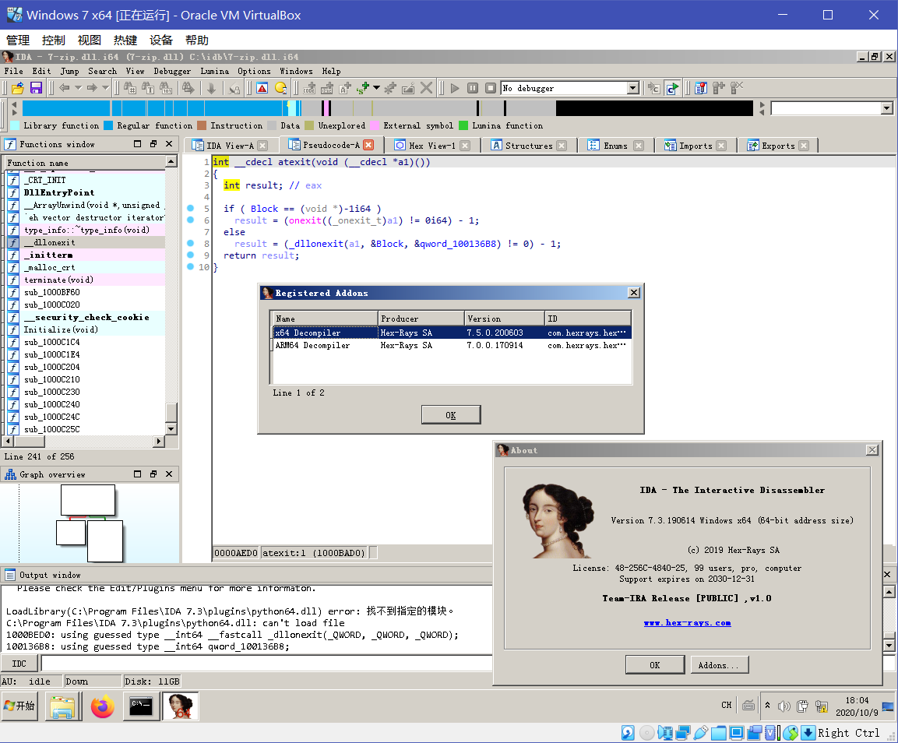

## *Transplanting* Hex-Rays Decompiler between IDA versions

**DISCLAIMER**: Apparently I cannot upload the patched binary and/or the original ones without [having GitHub yell at me](https://github.com/github/dmca/blob/master/2018/2018-04-05-HexRays.md) to [take it down](https://github.com/github/dmca/blob/master/2019/09/2019-09-12-Hex-Rays.md), so only binary diffs are provided.

### Hex-Rays 7.2 for IDA 7.3

Made x64 decompiler (`hexx64.dll`) from IDA Pro 7.2 compatible with IDA Pro 7.3.

Binary diff in <hexx64_7.2_7.3.txt>.

*TODO: Description on what has been done*

### Hex-Rays 7.5 Demo for IDA 7.2/7.3

btw, I've also tried to port x64 decompiler (`hexx64.dll`) from IDA Demo 7.5 downwards. Guess what? I made it, and of course, without (most of) the demo limitations.

Limitations that are still there:

- Some functions have their code removed, leaving a "full version only" message:
	- "Jump to xref globally": `hx:JumpGlobalXref`, Ctrl-Alt-X
	- "Create C file": `hx:CreateCFile`, Ctrl-F5, "File"-"Produce file"-"Create C file..."
	- "Extract function": `hx:ExtractFunc`, None, "Help"-"Extract function"
- ...

IDA Pro 7.0 will **NOT** work (not supported, at least) because of an inconsistency between SDKs which is nearly unpatchable. (Hint: `interr(884)`, `ud2 == 0x8a` in `create_tinfo`)

Binary diff in <hexx64_7.5_7.x.txt>. Shoutout to [ericyudatou@bbs.pediy.com](https://bbs.pediy.com/thread-262435.htm), without your hard work this patch would be impossible.

*TODO: Description on what has been done*

### Switch Hex-Rays on the fly

Say you're using IDA 7.2 and you want to try the decompilers above, but you're unwilling to lose your ability of exporting a huge C file from your database. (Oh, one thing to mention: **DO NOT** install more than one version of decompilers for one architecture; bad things will happen.) Other than renaming plugin files and reopen the database each time you wish to switch your decompiler, you can also try this plugin I've wrote.

Download the decompiler above, and rename it to `hexx64_7.5_7.x.bin`. Then, put it into the IDA plugins folder, alongside with this plugin. Use Alt-F5 to toggle between versions.

**NOTE**: This plugin is utilizing a lot of "hacky" methods to achieve its goal, and I havn't tested it much. Due to technical limitations, here are some notes and *don't*s while using this plugin:

- Any pseudocode view opened by the decompiler will be closed by the plugin when a switch occurs, because otherwise it will crash IDA.
- Any other plugin that is utilizing Hex-Rays SDK has a chance to cause IDA to crash when a switch occurs, except the `ida_hexrays` module in IDAPython environment.
- Each time a unique version of decompiler is loaded, it will create an entry in "Edit"-"Plugins" menu. There is no known way to remove that entry. Clicking on the entry will force load that version of the decompiler back, and will cause some issues.
- To sum it all up, use this plugin **AT YOUR OWN RISK**.

