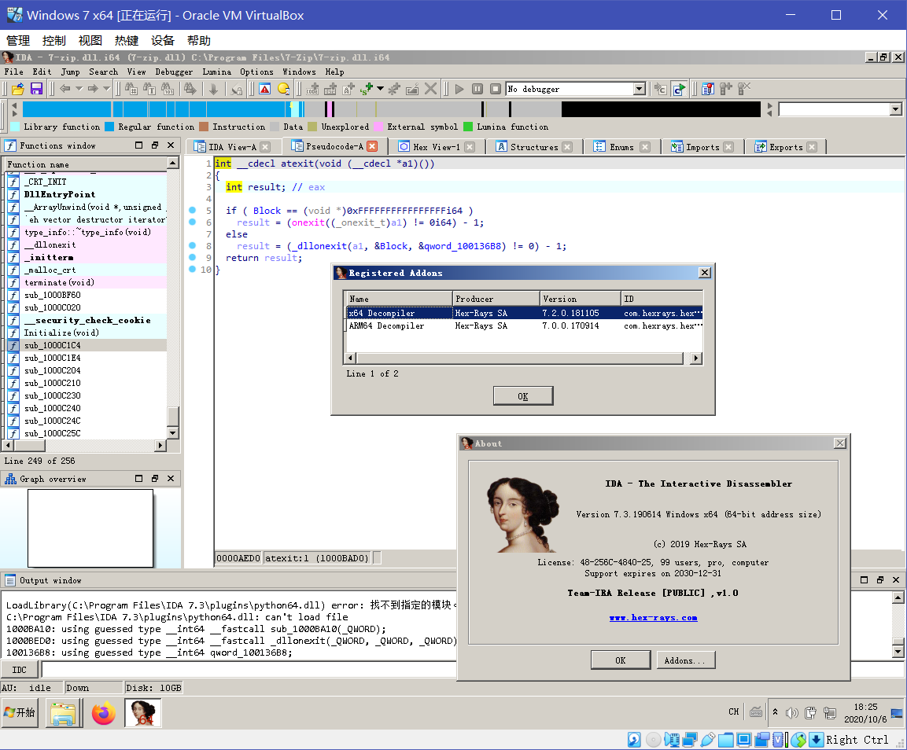
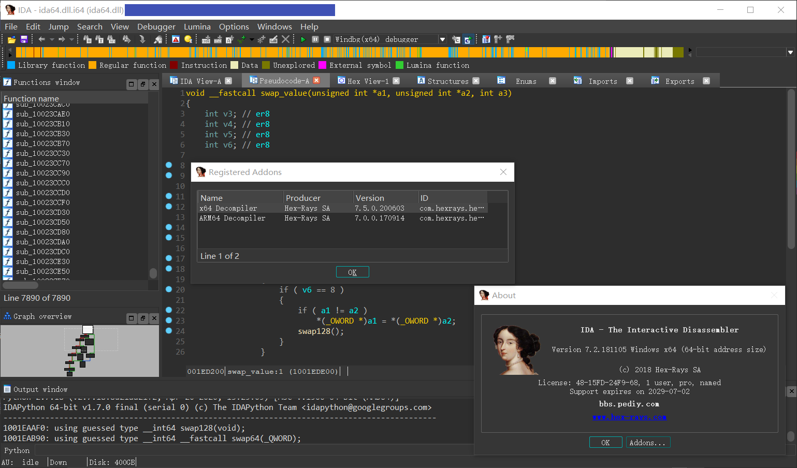

# Things regarding IDA Pro 7.3 leak

## IDA itself

*TODO: `UPX00` section in `ida64.dll`?*

## HexRays Decompiler

Made x64 decompiler (`hexx64.dll`) from IDA Pro 7.2 compatible with IDA Pro 7.3.

*TODO: Description on what has been done*

Apparently I cannot upload the modded binary and/or the original ones without [having GitHub yell at me](https://github.com/github/dmca/blob/master/2018/2018-04-05-HexRays.md) to [take it down](https://github.com/github/dmca/blob/master/2019/09/2019-09-12-Hex-Rays.md), so here is a binary diff in <hexx64_7.2_7.3.txt>.

btw, I've also tried to port x64 decompiler (`hexx64.dll`) from IDA Demo 7.5 downwards. Guess what? I made it, and of course, without (most of) the demo limitations.

Limitations that are still there:

- Some functions have their code removed, leaving a "full version only" message:
	- "Jump to xref globally": `hx:JumpGlobalXref`, Ctrl-Alt-X
	- "Create C file": `hx:CreateCFile`, Ctrl-F5, "File"-"Produce file"-"Create C file..."
	- "Extract function": `hx:ExtractFunc`, None, "Help"-"Extract function"
- ...

*TODO: Description on what has been done*

So another binary diff in <hexx64_7.5_7.x.txt>. Shoutout to [ericyudatou@bbs.pediy.com](https://bbs.pediy.com/thread-262435.htm), without your hard work this patch would be impossible.

